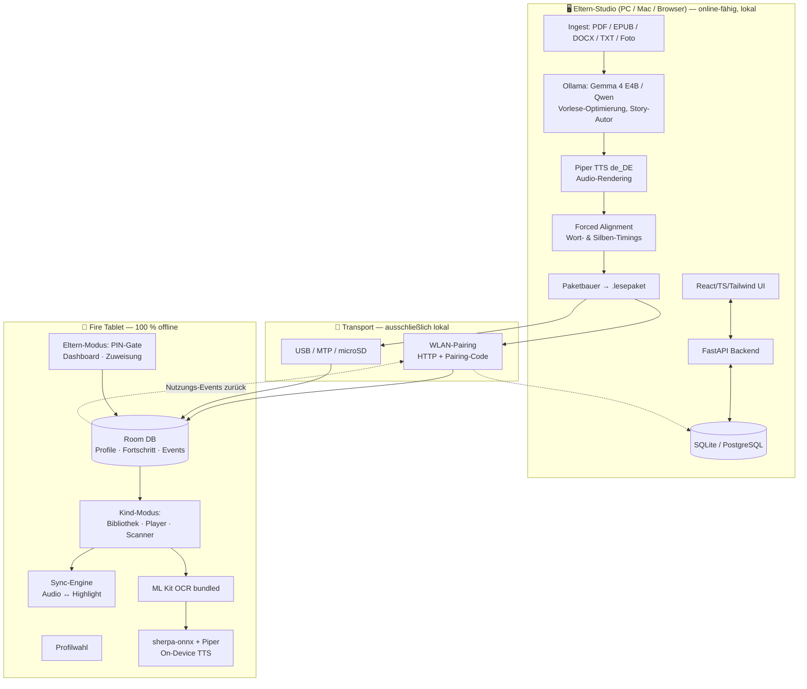
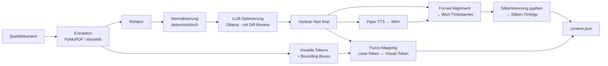
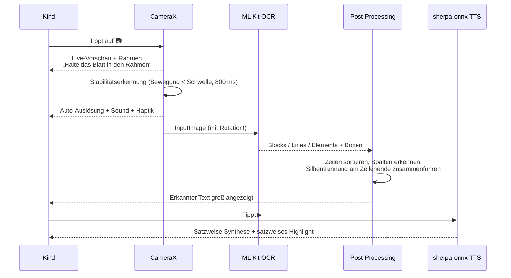

# Lesefuchs — Technisches Konzept

**Offline-Vorlese- und Lese-Lern-App für Amazon Fire Tablets (Kinder) mit Eltern-Studio (Desktop/Browser)**

Version 0.1 · Konzept- und Architekturentwurf
Autor: Patrick Wolff

---

## 1. TL;DR — Die fünf entscheidenden Weichenstellungen

| # | Entscheidung | Begründung |
|---|---|---|
| **1** | **Kein LLM auf dem Fire Tablet.** Gemma 4 E2B läuft dort nicht sinnvoll. | Fire Tablets haben max. **4 GB RAM** (Fire Max 11), meist 3 GB, MediaTek-SoCs ohne NPU. Gemma 4 E2B in INT4 braucht realistisch 6 GB RAM + moderne SoC. Fire OS 8 = Android 11. Ein Versuch endet in OOM oder <1 Token/s. |
| **2** | **Zwei-Welten-Architektur: „Studio" (Desktop) rechnet, „Player" (Tablet) spielt ab.** | Alle schwere KI (LLM, TTS-Synthese, Forced Alignment, Layout-Analyse) läuft am PC/Mac — dort hast du Ollama, GPU, Python. Das Tablet bekommt fertige Pakete: Bild + Text + **Audio + Millisekunden-genaue Timings**. → 100 % offline auf dem Tablet, aber in Studioqualität. |
| **3** | **Silben- und Wort-Cursor sind mit vorgerechneten Timings *exakt* lösbar** — nicht mit Live-TTS. | Forced Alignment am PC liefert Wort-Timestamps ±20 ms. Auf dem Tablet ist es dann nur noch `player.currentPosition` → Binärsuche im Token-Array. Silben via `pyphen` (deutsche Trennmuster) proportional aufgeteilt. |
| **4** | **Zwei getrennte Pipelines:** *Buch* (vorgerendert, perfekt) vs. *Kamera-Scan* (live, „gut genug"). | Für den Kamera-Scan brauchst du On-Device-OCR + On-Device-TTS. Highlighting dort nur satzweise + geschätzte Wortdauern. Das ist ein völlig anderes Qualitätsniveau — und das ist in Ordnung. |
| **5** | **Ein APK, drei Rollen** (Kind / Kind / Eltern) über PIN-Gate; Studio als separate Web-App (FastAPI + React), lokal, ohne Cloud. | Deckt deine Anforderung „gleiche App" ab, ohne die Kinder-UI mit Editor-Komplexität zu belasten. |

---

## 2. Plattform-Realitätscheck: Fire OS

### 2.1 Hardware

| Modell | RAM | SoC | Fire OS | Android-Basis | microSD |
|---|---|---|---|---|---|
| Fire 7 (2022) | 2 GB | MT8168V | 7 | 9 | ja |
| Fire HD 8 (2022/2024) | 2–4 GB | MT8169A | 8 | 11 | ja |
| Fire HD 10 (2023) | 3 GB | MT8186 | 8 | 11 | ja |
| **Fire HD 10 (2026)** | **4 GB** | MT8186 | 8 | 11 | ja |
| **Fire Max 11** | **4 GB** | MT8188J (2×A78 + 6×A55, Mali-G57 MC2) | 8 | 11 | ja (dediziert) |

**Empfehlung Zielgerät:** Fire Max 11 oder Fire HD 10 (2026). Das ist die einzige Klasse, auf der ein VITS-TTS-Modell flüssig läuft und die Bildschirmfläche für Buchseite + Highlight ausreicht.

### 2.2 Konsequenzen für die Entwicklung

| Constraint | Auswirkung |
|---|---|
| **Keine Google Play Services (GMS)** | Kein Firebase, kein Google TTS (out of the box), keine `com.google.android.gms:*`-Abhängigkeiten. → **ML Kit nur in der „bundled"-Variante** (`com.google.mlkit:text-recognition`, Modell statisch im APK, ~4 MB/Skript/ABI). |
| **Fire OS 8 = Android 11 (API 30)** | `minSdk 28`, `targetSdk 34`. Scoped Storage beachten. `onRangeStart()` für TTS-Wortgrenzen ist ab API 26 vorhanden — **ob die Fire-eigene TTS-Engine es implementiert, ist offen** (→ Spike M0). |
| **Nur `arm64-v8a` nötig** | Halbiert die APK-Größe bei nativen Libs (sherpa-onnx). |
| **Sideload** | `Einstellungen → Sicherheit & Datenschutz → Apps unbekannter Herkunft` oder `adb install`. Kein Store, kein automatisches Update → Update-Prozess selbst bauen (siehe §9.3). |
| **Amazon Kids** | Sideloadete Apps lassen sich in Kinderprofile aufnehmen. **Alternative und Empfehlung:** Amazon Kids *nicht* nutzen, sondern App-eigene Profile + Android **Screen-Pinning / Lock Task Mode** — sonst hast du zwei konkurrierende Profilsysteme. |
| **Kamera** | 5–8 MP, oft ohne guten AF beim HD 10 → OCR-Qualität ist der Flaschenhals, nicht das Modell. Fire Max 11 hat 8 MP mit AF. |

---

## 3. Architektur: Studio & Player



**Leitprinzip:** Das Tablet enthält **keine Generierungslogik**, nur Wiedergabe + einen kleinen OCR/TTS-Pfad für Ad-hoc-Scans. Damit ist die App auf schwacher Hardware schnell, batteriearm und robust.

---

## 4. Content-Pipeline & Paketformat

### 4.1 Zwei Inhaltstypen

| Typ | Quelle | Darstellung | Highlight-Verfahren |
|---|---|---|---|
| **A — Faksimile** | PDF, gescanntes Buch, Bilderbuch | Original-Seitenbild bleibt erhalten (WebP) | Overlay-Rechtecke über Wortkoordinaten |
| **B — Reflow** | KI-generierte Geschichte, TXT, DOCX, EPUB | Typografie in der App gerendert (Andika, große Schrift, Silbenfärbung) | Direktes Span-Highlighting — trivial und pixelperfekt |

**Typ B ist der einfachere und für Leseanfänger *bessere* Weg.** Typ A brauchst du für vorhandene Bücher. Beide sind im gleichen Paketformat abbildbar.

### 4.2 Paketformat `.lesepaket` (ZIP)

```
buchtitel_v3.lesepaket
├── manifest.json          # Metadaten, Lesestufe, Prüfsummen
├── content.json           # Vorlese-Text, Tokens, Timings, Visual-Mapping
├── pages/                 # nur Typ A
│   ├── p001.webp          # 1600px lange Kante, Q=80
│   └── ...
├── audio/
│   ├── ch01.opus          # 24 kHz mono, ~24 kbps (Opus kennt nur 8/12/16/24/48 kHz)
│   └── ...
├── cover.webp
└── glossar.json           # optional: schwere Wörter + kindgerechte Erklärung + Audio
```

### 4.3 `manifest.json`

```json
{
  "schema": "lesefuchs/1.0",
  "id": "0193f2a1-...",
  "title": "Der kleine Drache Kokosnuss",
  "author": "…",
  "type": "FACSIMILE",
  "language": "de-DE",
  "readingLevel": 2,
  "pageCount": 48,
  "durationMs": 1834000,
  "voice": "de_DE-thorsten-medium",
  "createdAt": "2026-08-19T10:12:00Z",
  "packageVersion": 3,
  "checksums": { "content.json": "sha256:…" },
  "chapters": [
    { "id": "ch01", "title": "Kapitel 1", "audio": "audio/ch01.opus",
      "firstPage": 1, "lastPage": 12, "tokenStart": 0, "tokenEnd": 842 }
  ]
}
```

### 4.4 `content.json` — das Herzstück

Der Kern ist die Trennung von **Lesetext** (was gesprochen wird) und **visuellem Text** (was auf der Seite steht) mit einer expliziten Abbildung dazwischen. Das ist notwendig, weil die Eltern den Vorlesetext optimieren dürfen — er weicht dann vom Original ab.

```json
{
  "tokens": [
    {
      "i": 128,
      "w": "Kokosnuss",
      "t0": 41250,
      "t1": 41980,
      "sent": 17,
      "para": 4,
      "syl": [
        { "s": "Ko",  "t0": 41250, "t1": 41460 },
        { "s": "kos", "t0": 41460, "t1": 41700 },
        { "s": "nuss","t0": 41700, "t1": 41980 }
      ],
      "vis": {
        "page": 7,
        "boxes": [ { "x": 0.213, "y": 0.442, "w": 0.118, "h": 0.026 } ]
      },
      "hard": true
    },
    {
      "i": 129, "w": "zwölf", "t0": 41980, "t1": 42340, "sent": 17, "para": 4,
      "syl": [ { "s": "zwölf", "t0": 41980, "t1": 42340 } ],
      "vis": { "page": 7, "boxes": [ { "x": 0.334, "y": 0.442, "w": 0.061, "h": 0.026 } ] },
      "src": "12"
    }
  ],
  "sentences": [
    { "i": 17, "t0": 40100, "t1": 44210, "tokenStart": 121, "tokenEnd": 138, "page": 7 }
  ],
  "paragraphs": [ { "i": 4, "page": 7, "sentenceStart": 15, "sentenceEnd": 21 } ]
}
```

**Design-Details, die sich später rächen, wenn man sie weglässt:**

- `vis.boxes` ist ein **Array** — ein Wort kann über einen Zeilenumbruch hinweg getrennt sein (`Ko-` / `kosnuss`) und braucht dann zwei Rechtecke.
- `vis` darf **`null`** sein: Wörter, die im Vorlesetext eingefügt wurden („zwölf" statt „12" ist noch abbildbar, ein eingefügtes Bindewort nicht). Der Cursor bleibt dann auf dem letzten gültigen Wort stehen, das Satz-Highlight bleibt aktiv.
- Koordinaten **normalisiert auf 0..1** relativ zur Seite → auflösungs- und zoomunabhängig.
- `src` hält das Original-Token für die Anzeige (Zahl bleibt „12", gelesen wird „zwölf").
- `hard: true` markiert Wörter aus dem Glossar → antippbar für kindgerechte Erklärung.

### 4.5 Alignment-Pipeline (Studio)



**Werkzeugempfehlungen:**

| Schritt | Werkzeug | Anmerkung |
|---|---|---|
| PDF-Extraktion | **PyMuPDF** `page.get_text("words")` | Liefert `(x0,y0,x1,y1,wort,block,line,word_no)` direkt. Bei Scans ohne Textlayer: OCR mit **PaddleOCR** oder **Tesseract** (`deu`, `tessdata_best`). |
| Seitenrendering | PyMuPDF `page.get_pixmap(dpi=150)` → WebP | Vorrendern spart dem Tablet den PDF-Renderer komplett. |
| Text-Normalisierung | **`num2words(lang='de')`**, eigene Abkürzungstabelle | **Nicht dem LLM überlassen** — Zahlen, Daten, Einheiten deterministisch expandieren, sonst halluziniert es still. |
| TTS | **Piper** `de_DE-thorsten-medium` (männlich), `de_DE-eva_k-x_low`, `de_DE-kerstin-low`, `de_DE-ramona-low` | MIT/CC. Kinderohren mögen `eva_k` und `kerstin` erfahrungsgemäß mehr. Sample-Test mit den Kindern machen. |
| Forced Alignment | **WhisperX** (wav2vec2-Alignmentmodell `de`) → primär<br/>**aeneas** → leichtgewichtige Alternative | WhisperX ist genauer auf Wortebene; aeneas ist reine CPU, schnell, für Satzebene völlig ausreichend. |
| Silbentrennung | **`pyphen`** mit `de_DE` | Liefert Trennstellen nach deutschen Mustern. Dauer proportional nach Silbenlänge, gewichtet: Vokalkerne zählen doppelt. |
| Fuzzy-Mapping | **RapidFuzz** + `difflib.SequenceMatcher` | Auf normalisierten Tokens (lowercase, ohne Interpunktion). Ergebnis 1:1, 1:n, n:1 oder null. |
| Audio-Encoding | `ffmpeg -c:a libopus -b:a 24k -ar 24000 -ac 1` | 30-Minuten-Kapitel ≈ 5 MB. Opus unterstützt nur 8/12/16/24/48 kHz — 22,05 kHz (frühere Angabe) ist mit libopus nicht möglich. |

**Exakter statt geschätzter Timings — optionale Ausbaustufe:** Piper-Modelle sind VITS. Der Duration Predictor im ONNX-Graph liefert Phonemdauern direkt. Wer den Graphen um einen zusätzlichen Output erweitert (`w_ceil`), bekommt exakte Phonem→Silben→Wort-Timings **ohne** Alignment-Schritt. Lohnt sich, wenn die Alignment-Laufzeit stört — für den Anfang unnötig.

---

## 5. Modul: Tablet-App (Player)

### 5.1 Technischer Stack

| Bereich | Wahl | Begründung |
|---|---|---|
| Sprache / UI | **Kotlin + Jetpack Compose** | Compose rendert Highlight-Overlays und Cursor-Animation performant, `Canvas`-Zugriff ohne Umwege. |
| Min/Target SDK | `minSdk 28`, `targetSdk 34`, ABI `arm64-v8a` | Deckt Fire OS 7 & 8 ab, hält das APK klein. |
| Kamera | **CameraX** (`camera-core`, `camera-camera2`, `camera-lifecycle`, `camera-view`) | Läuft ohne GMS. |
| OCR | **ML Kit bundled** `com.google.mlkit:text-recognition:16.x` | Statisch gelinkt, kein Play Services nötig. **Fallback (falls auf Fire OS Probleme):** `Tesseract4Android` + `deu.traineddata` — vollständig Open Source, dafür schwächer bei Fotos. |
| TTS (Live) | **sherpa-onnx** (ONNX Runtime) + Piper-Modell im Asset | Unabhängig von Fire-OS-Engines, identische Stimme wie im Studio, deterministisch. ~63 MB Modell + ~12 MB native Libs. |
| TTS-Fallback | `android.speech.tts.TextToSpeech` | Nur, falls sherpa-onnx auf dem Zielgerät scheitert. Wortgrenzen über `UtteranceProgressListener.onRangeStart()` — Engine-Support ungewiss. |
| Audio-Wiedergabe | **Media3 / ExoPlayer** | Genaue `currentPosition`, Geschwindigkeitsregelung (0,7×–1,3×) über `PlaybackParameters`, Opus-Support nativ. |
| Persistenz | **Room** + **DataStore** | Profile, Fortschritt, Events, Einstellungen. |
| Bilder | **Coil** | WebP-Seiten, Speicher-effizientes Caching. |
| Diagramme | **Vico** (Compose-nativ) | Eltern-Dashboard. |
| Schrift | **Andika** (SIL, OFL) | Explizit für Leselernende entworfen: eindeutige a/g, unterscheidbare I/l/1. Optional **OpenDyslexic** als Umschaltoption. |

**Erwartete Größen:** APK ≈ 110–140 MB (Piper-Modell dominiert). Laufzeit-RAM des Players ≈ 250–350 MB → unkritisch auf 3–4 GB.

### 5.2 Bildschirme

```
┌─ Profilwahl ────────────────────────────────────────┐
│  Große Avatar-Kacheln, Name, Farbe.                 │
│  Eltern-Kachel unten rechts, klein, mit Schloss.    │
└─────────────────────────────────────────────────────┘
        ↓ Kind                              ↓ Eltern (PIN 6-stellig)
┌─ Kind-Startseite ───────────┐   ┌─ Eltern-Bereich ──────────────┐
│  [📚 Meine Bücher]          │   │  Dashboard (Statistik)        │
│  [📷 Text fotografieren]    │   │  Kinder & Profile             │
│  Fortschritts-Bär oben      │   │  Bibliothek & Zuweisung       │
└─────────────────────────────┘   │  Import / Sync                │
        ↓                          │  Einstellungen               │
┌─ Bibliothek ────────────────┐   └───────────────────────────────┘
│  Cover-Raster, große Ziele  │
│  Fortschrittsring pro Buch  │
└─────────────────────────────┘
        ↓
┌─ Player ────────────────────────────────────────────┐
│  Seitenbild bzw. gesetzter Text, formatfüllend      │
│  Aktiver Satz: sanfter Hintergrund                  │
│  Aktives Wort: kräftiger Marker                     │
│  Silben-Cursor: dünne Linie, läuft mit              │
│  Unten: ▶︎ ⏸  ⏮ ⏭  🐢/🐇  ← große Flächen (≥64 dp)   │
└─────────────────────────────────────────────────────┘
```

### 5.3 Die Sync-Engine (Kern der App)

```kotlin
// Vereinfachtes Modell
class HighlightEngine(private val content: Content) {
    private var cachedIdx = 0

    fun stateAt(posMs: Long): HighlightState {
        val idx = findToken(posMs)          // lineare Suche ab cachedIdx,
        val tok = content.tokens[idx]       // Fallback Binärsuche bei Sprung
        val syl = tok.syllables.firstOrNull { posMs in it.t0..it.t1 }

        // Cursor-Position innerhalb der Silbe linear interpoliert
        val frac = syl?.let { (posMs - it.t0).toFloat() / (it.t1 - it.t0) } ?: 0f

        return HighlightState(
            sentence = content.sentences[tok.sent],
            token = tok,
            syllable = syl,
            cursorFraction = frac
        )
    }
}
```

**Rendering-Regeln:**

- Aktualisierung über `Choreographer` bzw. `withFrameNanos` → 60 fps, kein Timer-Polling.
- Highlight-Rechtecke werden **nicht** neu berechnet, sondern nur animiert (`animateRectAsState`, ~120 ms) → weiches Springen von Wort zu Wort statt Zucken.
- **Lead-Offset** von ca. −60 ms: Das Auge muss minimal *vor* dem Ohr sein, sonst wirkt es „hinterher". Konfigurierbar in den Eltern-Einstellungen.
- Bei Seitenwechsel: Auto-Scroll mit 400-ms-Übergang, nie abrupt.
- Antippen eines Wortes → Sprung zur Audioposition dieses Wortes (`t0`). Das ist für Kinder die intuitivste Navigation überhaupt und praktisch kostenlos umzusetzen.

### 5.4 Highlight-Modi (pro Kind einstellbar)

| Modus | Zielgruppe | Darstellung |
|---|---|---|
| `SENTENCE` | Vorschule, Zuhören | Nur der aktive Satz farbig hinterlegt |
| `WORD` | Leseanfänger | Satz blass + aktives Wort kräftig |
| `SYLLABLE` | Leselernphase | zusätzlich Silbencursor + **Silbenfärbung** (abwechselnd blau/rot, wie in deutschen Fibeln nach der Silbenmethode) |
| `KARAOKE` | Fortgeschritten | Wischeffekt, der den Text zeichenweise einfärbt |

Die Silbenfärbung ist ein didaktisch bewährtes Verfahren aus deutschen Erstlesebüchern — und du bekommst sie durch `pyphen` ohnehin geschenkt.

### 5.5 Kamera-Scan-Flow (Kind)



**Visuelles Feedback für Kinder (nicht verhandelbar):**
- Der Rahmen färbt sich **grün**, sobald genug Text erkannt wird → Kind weiß, wann es auslösen kann.
- Nach der Aufnahme: kurze „Zauber"-Animation über dem Bild, während OCR läuft (200–600 ms).
- Wird kein Text gefunden: kein Fehlertext, sondern eine gesprochene Ansage („Ich sehe keine Wörter — probier es näher!") + Illustration.
- Ergebnis kann per ⭐ in „Meine Funde" gespeichert werden.

**Timing-Schätzung ohne Alignment:** Satz synthetisieren → gemessene Dauer proportional auf die Wörter verteilen, gewichtet nach Silbenzahl (deutsche Silbenzählung über Vokalgruppen ist ~95 % treffsicher) + 60 ms Pauschale pro Satzzeichen. Reicht für satz- und grob wortgenaues Highlight völlig aus.

---

## 6. Modul: Eltern-Studio (Desktop)

### 6.1 Stack

| Bereich | Wahl |
|---|---|
| Backend | **Python 3.12 + FastAPI**, SQLModel, SQLite (Einzelplatz) bzw. PostgreSQL |
| Frontend | **React + TypeScript + Tailwind + shadcn/ui**, Recharts |
| Dokumente | PyMuPDF, ebooklib, python-docx, Pillow |
| KI | **Ollama** (Gemma 4 E4B / Qwen3) über `/api/chat`; austauschbarer Provider-Layer für spätere Anthropic-API-Nutzung |
| TTS | Piper (`piper-tts` Python oder CLI) |
| Alignment | WhisperX bzw. aeneas |
| Paketierung | **Tauri v2** (Rust-Shell um das React-Frontend, Sidecar startet FastAPI) → native App für Windows & macOS |
| Alternative | reines `docker compose up` + Browser auf `localhost:8080` — für dich der schnellere Weg, für Nicht-Techniker der schlechtere |

**Empfehlung:** Für dich zuerst **Docker + Browser** (Tag 1 lauffähig), Tauri-Paketierung erst in M6, falls die App jemals das Haus verlässt.

### 6.2 Editor-Konzept: Zwei-Spalten-Ansicht

```
┌─────────────────────────────┬──────────────────────────────┐
│  VISUELL (Original)         │  VORLESE-TEXT (bearbeitbar)  │
│  ┌───────────────────────┐  │                              │
│  │                       │  │  Der kleine Drache flog      │
│  │   [Seitenbild]        │  │  über zwölf Berge. ✎         │
│  │   Wortboxen als       │  │  ▸ Silben: Dra-che           │
│  │   Overlay, klickbar   │  │  ▸ ⚠ nicht zugeordnet: „und" │
│  └───────────────────────┘  │                              │
│  ◀ Seite 7 / 48 ▶           │  [▶︎ Probe hören]             │
└─────────────────────────────┴──────────────────────────────┘
│  KI-Werkzeuge: [Vorlese-Optimierung] [Vereinfachen Stufe ▾]  │
│                [Schwere Wörter erklären] [Neu vertonen]      │
└──────────────────────────────────────────────────────────────┘
```

- Klick links auf ein Wort → springt rechts an die Stelle. Und umgekehrt.
- Nicht zugeordnete Tokens werden **sichtbar markiert** — du siehst sofort, wo das Highlight später aussetzen wird, und kannst manuell verknüpfen.
- Jede KI-Änderung landet in einer **Diff-Ansicht mit Annehmen/Verwerfen pro Absatz**. Kein stilles Umschreiben von Kinderbuchtext.
- „Neu vertonen" arbeitet **inkrementell** — nur geänderte Absätze werden neu synthetisiert und ausgerichtet. Ein 48-Seiten-Buch komplett neu zu rendern dauert sonst Minuten.

### 6.3 KI-Funktionen und Beispiel-Prompts

#### a) Vorlese-Optimierung

```markdown
# Rolle
Du bereitest Text für die Sprachsynthese in einer Kinder-Vorlese-App auf.

# Aufgabe
Überarbeite den Eingabetext so, dass er von einer TTS-Engine natürlich
vorgelesen werden kann. Der Inhalt bleibt inhaltlich identisch.

# Regeln
1. Entferne: Kopf- und Fußzeilen, Seitenzahlen, Fußnotenmarken,
   Trennstriche am Zeilenende (füge die Wörter zusammen).
2. Löse Abkürzungen auf: "z. B." → "zum Beispiel", "u. a." → "unter anderem".
3. Setze fehlende Satzzeichen, wenn OCR sie verschluckt hat.
4. Teile Sätze mit mehr als {max_woerter} Wörtern an natürlichen Stellen.
5. Direkte Rede bleibt wörtlich erhalten. Eigennamen bleiben unverändert.
6. Füge NICHTS hinzu, was nicht im Original steht. Kürze NICHTS weg.
7. Zahlen NICHT ausschreiben — das erledigt ein nachgelagerter Schritt.

# Ausgabeformat
Nur der überarbeitete Text. Kein Kommentar, kein Markdown, keine Backticks.
Absätze durch Leerzeile getrennt.

# Lesestufe
{lesestufe}  (1 = Vorschule, 2 = 1./2. Klasse, 3 = 3./4. Klasse)

# Eingabetext
{text}
```

#### b) Geschichten-Autor

```markdown
# Rolle
Du bist Autor von deutschen Kindergeschichten zum Vorlesen.

# Auftrag
Schreibe eine Geschichte nach den folgenden Vorgaben.

| Parameter        | Wert                |
|------------------|---------------------|
| Thema            | {thema}             |
| Alter des Kindes | {alter}             |
| Hauptfigur(en)   | {figuren}           |
| Länge            | {laenge_minuten} Minuten Vorlesezeit (≈ {woerter} Wörter) |
| Kernbotschaft    | {botschaft}         |
| Kapitelanzahl    | {kapitel}           |

# Sprachliche Vorgaben
- Sätze im Schnitt {satzlaenge} Wörter, maximal {max_woerter}.
- Wortschatz altersgerecht; höchstens {n_schwere} bewusst neue Wörter,
  jeweils im Satz selbst verständlich gemacht.
- Viel direkte Rede, konkrete Bilder, wenig Abstraktion.
- Keine Gewalt, keine Angstmotive ohne Auflösung, kein offenes Ende.
- Ein wiederkehrendes Sprachmotiv oder ein Reim als Anker.

# Ausgabeformat (striktes JSON, sonst nichts)
{
  "titel": "…",
  "kapitel": [
    { "nummer": 1, "titel": "…", "absaetze": ["…", "…"] }
  ],
  "schwere_woerter": [
    { "wort": "…", "erklaerung": "kindgerechte Erklärung in einem Satz" }
  ],
  "verstaendnisfragen": [
    { "frage": "…", "antwort": "…" }
  ]
}
```

#### c) Weitere Funktionen

| Funktion | Beschreibung |
|---|---|
| **Vereinfachen auf Lesestufe** | Ganzes Buch auf Stufe 1–3 herunterbrechen; erzeugt eine *Variante* desselben Buchs, nicht ein Überschreiben. |
| **Glossar erzeugen** | Schwere Wörter identifizieren, kindgerecht erklären, Erklärung mit Piper vertonen → antippbar im Player. |
| **Verständnisfragen** | 3–5 Fragen pro Kapitel, im Player als Abschlussspiel. |
| **Illustrationen (optional, später)** | Lokal via ComfyUI/SDXL. Erhöht die Komplexität deutlich — bewusst nach hinten schieben. |

---

## 7. Datenmodell

### 7.1 Tablet (Room)

```kotlin
@Entity data class Child(
    @PrimaryKey val id: String,
    val name: String,
    val avatarKey: String,
    val colorHex: String,
    val birthYear: Int,
    val readingLevel: Int,          // 1..3
    val createdAt: Long
)

@Entity data class ChildSettings(
    @PrimaryKey val childId: String,
    val highlightMode: HighlightMode,   // SENTENCE | WORD | SYLLABLE | KARAOKE
    val syllableColoring: Boolean,
    val speechRate: Float,              // 0.7 .. 1.3
    val fontScale: Float,               // 1.0 .. 1.8
    val fontFamily: String,             // andika | opendyslexic
    val leadOffsetMs: Int,              // Default -60
    val scannerEnabled: Boolean,
    val dailyLimitMinutes: Int?,        // null = unbegrenzt
    val quietHoursStart: Int?,          // Minuten seit Mitternacht
    val quietHoursEnd: Int?
)

@Entity data class ContentPackage(
    @PrimaryKey val id: String,
    val title: String, val author: String?,
    val type: PackageType,              // FACSIMILE | REFLOW
    val readingLevel: Int,
    val durationMs: Long,
    val pageCount: Int,
    val rootPath: String,               // entpackt auf SD oder intern
    val version: Int,
    val importedAt: Long,
    val sizeBytes: Long
)

@Entity(primaryKeys = ["childId","packageId"])
data class Assignment(
    val childId: String, val packageId: String,
    val assignedAt: Long,
    val unlockAt: Long?,                // zeitgesteuerte Freischaltung
    val expiresAt: Long?,
    val orderIndex: Int,
    val isFavorite: Boolean
)

@Entity(primaryKeys = ["childId","packageId"])
data class Progress(
    val childId: String, val packageId: String,
    val lastPage: Int, val lastPositionMs: Long, val lastTokenIndex: Int,
    val listenCount: Int, val completedAt: Long?,
    val totalListenedMs: Long
)

@Entity data class UsageEvent(              // append-only, Basis der Statistik
    @PrimaryKey(autoGenerate = true) val id: Long = 0,
    val childId: String,
    val packageId: String?,
    val type: EventType,                // OPEN|PLAY|PAUSE|SEEK|PAGE|WORD_TAP|
                                        // GLOSSARY|SCAN|QUIZ|FINISH|CLOSE
    val tsUtc: Long,
    val page: Int?, val positionMs: Long?, val durationMs: Long?,
    val syncedAt: Long?                 // null = noch nicht ans Studio übertragen
)

@Entity data class ScanItem(
    @PrimaryKey val id: String,
    val childId: String, val imagePath: String,
    val recognizedText: String, val createdAt: Long,
    val savedToLibrary: Boolean
)
```

### 7.2 Fortschritts- und Nutzungsmetriken

Aus `UsageEvent` ableitbar — bewusst als Event-Stream statt als vorberechnete Zähler, damit du später neue Auswertungen ohne Datenverlust ergänzen kannst (dein üblicher Event-Sourcing-Ansatz).

| Kennzahl | Ableitung |
|---|---|
| Hörzeit pro Tag / Kind | Σ (PAUSE.ts − PLAY.ts), bereinigt um Sessions ohne CLOSE |
| Aktive Tage / Streak | `COUNT(DISTINCT date(tsUtc))` |
| Bücher abgeschlossen | `FINISH`-Events |
| Fortschritt je Buch | `lastTokenIndex / tokenCount` |
| Wörter gehört | Σ Tokens in gehörten Zeitspannen |
| Wiederholungen | `listenCount > 1` — starkes Signal für Lieblingsbücher |
| Glossar-Nutzung | `GLOSSARY`-Events → welche Wörter sind schwer? |
| Scan-Aktivität | `SCAN`-Events pro Woche |
| Tageszeit-Verteilung | Heatmap Wochentag × Stunde |

### 7.3 Eltern-Dashboard

**Auf dem Tablet (Vico) und im Studio (Recharts) identisch:**

1. **Kopfzeile:** Kachel je Kind — Hörzeit diese Woche, Streak, aktuelles Buch mit Fortschrittsring.
2. **Zeitreihe:** Lesezeit pro Tag, 30 Tage, Linie je Kind, Wochenenden schattiert.
3. **Balken:** Top-10-Inhalte nach Hörzeit, gestapelt nach Kind.
4. **Heatmap:** Wochentag × Stunde — zeigt, ob die App wirklich zur Lesezeit genutzt wird.
5. **Tabelle:** Aktivitätsprotokoll (Kind · Inhalt · Zeitpunkt · Dauer · abgeschlossen?) mit Filter und CSV-Export.
6. **Signal-Karten:** „Emma hört Kapitel 3 zum vierten Mal", „Mia hat seit 6 Tagen nicht gelesen", „Häufigste Glossar-Wörter dieser Woche".

Punkt 6 ist das, was ein Dashboard von einer Zahlenwand unterscheidet — abgeleitete Aussagen statt Rohmetriken.

---

## 8. Transport & Synchronisation (ohne Cloud)

### 8.1 Kanäle

| Priorität | Kanal | Ablauf |
|---|---|---|
| **1** | **WLAN-Direkt** | Studio startet HTTP-Server auf Port 8443 (selbstsigniertes TLS). Tablet findet ihn via **NSD/mDNS** (`_lesefuchs._tcp`) oder per manueller IP. Kopplung über 6-stelligen Code, danach ausgetauschter Geräteschlüssel (Ed25519). |
| 2 | **USB / MTP** | `.lesepaket` nach `/sdcard/Lesefuchs/inbox/` kopieren, App erkennt es beim Start. |
| 3 | **microSD** | Für große Bibliotheken; Pakete bleiben auf der Karte, nur der Index landet in Room. |

### 8.2 Rückkanal (Statistik)

Beim WLAN-Sync überträgt das Tablet alle `UsageEvent` mit `syncedAt IS NULL` als NDJSON, signiert mit dem Geräteschlüssel. Das Studio dedupliziert über `(deviceId, eventId)`. Ohne WLAN-Sync bleibt die Statistik trotzdem auf dem Tablet im Eltern-Bereich vollständig sichtbar — der Sync ist Komfort, keine Voraussetzung.

### 8.3 Update-Strategie für die App

Kein Store, also: Beim WLAN-Sync meldet das Studio die neueste APK-Version. Tablet zeigt „Neue Version verfügbar", lädt die APK und ruft den Package Installer. Erfordert `REQUEST_INSTALL_PACKAGES` und eine einmalige Nutzerbestätigung — für den Familiengebrauch akzeptabel.

---

## 9. Sicherheit, Datenschutz, Kinderschutz

| Thema | Umsetzung |
|---|---|
| **Datensparsamkeit** | Keine Accounts, keine Telemetrie, keine Netzwerkverbindung außer im expliziten Sync-Modus. Der Kindermodus hat **keine** `INTERNET`-Nutzung — der Netzwerkcode sitzt ausschließlich im Eltern-Modul. |
| **DSGVO** | Rein familiäre Nutzung → Haushaltsausnahme, Art. 2 Abs. 2 lit. c DSGVO. **Sobald du das an Dritte verteilst, ändert sich das grundlegend** (Art. 8 DSGVO, Einwilligung der Sorgeberechtigten, TTDSG). Für eine spätere Weitergabe: Architektur bleibt local-only → das ist dann das stärkste Argument, das du haben kannst. |
| **Zugangstrennung** | Eltern-PIN (6-stellig, Argon2id-gehasht in DataStore). Zusätzlich optionale Rechenaufgabe als Kinder-Barriere. Kein Zurück-Weg aus dem Kindermodus ohne PIN. |
| **Lock Task Mode** | `startLockTask()` sperrt das Kind in der App (Bestätigungsdialog beim ersten Mal). **Auf Fire OS im Spike verifizieren** — Amazon entfernt gelegentlich AOSP-Funktionen. |
| **Inhaltskontrolle** | Kinder sehen ausschließlich explizit zugewiesene Pakete. Kein Katalog, keine Empfehlungen, kein Store. |
| **Kamera** | Fotos bleiben lokal, `getFilesDir()`, nicht in der Galerie (`.nomedia`). Automatische Löschung nach N Tagen, konfigurierbar. |
| **Bildschirmzeit** | Tageslimit + Ruhezeiten pro Kind; sanftes Auslaufen („noch 5 Minuten"), nie harter Abbruch mitten im Kapitel. |
| **KI-Transparenz** | Jedes Paket trägt im Manifest, ob und mit welchem Modell der Text erzeugt/überarbeitet wurde. Im Eltern-Bereich sichtbar. |
| **Urheberrecht** | Für eingescannte/importierte Bücher gilt Privatkopie-Recht (§ 53 UrhG) — solange die Pakete den Haushalt nicht verlassen. Im Studio einen entsprechenden Hinweis beim Import einblenden. |

---

## 10. Risiken & Gegenmaßnahmen

| Risiko | Wahrsch. | Auswirkung | Gegenmaßnahme |
|---|---|---|---|
| Lokales LLM auf dem Tablet unbrauchbar | **hoch** | hoch | Bereits gelöst durch Studio/Player-Trennung. Kein LLM auf dem Tablet. |
| ML Kit bundled läuft auf Fire OS nicht | mittel | mittel | Spike M0. Fallback Tesseract4Android (`deu`, `tessdata_best`). |
| sherpa-onnx zu langsam auf MediaTek | mittel | mittel | `x_low`-Piper-Modell statt `medium`; Vorsynthese von Standardsätzen; Notfall-Fallback auf Fire-OS-TTS. |
| Fire-OS-TTS liefert kein `onRangeStart` | hoch | niedrig | Wortdauern schätzen (Silbenzahl-Gewichtung). Betrifft nur den Scan-Pfad. |
| Wort↔Box-Mapping bei Faksimile fehlerhaft | mittel | mittel | Manueller Korrekturmodus im Studio; nicht zugeordnete Tokens sichtbar markieren; Satz-Highlight als Auffangnetz. |
| OCR-Qualität der Tablet-Kamera schlecht | hoch | mittel | Stabilitätserkennung + Auto-Fokus + Rahmenhilfe + Grünsignal; realistische Erwartung: gedruckter Fließtext ja, Handschrift nein. |
| Bücher belegen den Speicher | mittel | niedrig | Opus 24 kbps, WebP Q80, microSD-Unterstützung, Archivieren im Eltern-Bereich. |
| LLM verändert Buchinhalt still | mittel | hoch | Diff-Review pro Absatz mit Annehmen/Verwerfen. Zahlen deterministisch, nicht per LLM. |
| Amazon Kids kollidiert mit App-Profilen | mittel | niedrig | Amazon Kids nicht verwenden; App-eigene Profile + Lock Task. |
| Scope Creep (Illustrationen, Quiz, Gamification) | **hoch** | hoch | Strikte Meilensteine, siehe §11. M1–M3 sind das Produkt, alles danach ist Kür. |

---

## 11. Roadmap

| MS | Inhalt | Ergebnis | Aufwand (PT) |
|---|---|---|---|
| **M0** | **Spike auf echtem Gerät** — ML Kit bundled? sherpa-onnx Latenz? TTS-Stimmenwahl mit den Kindern testen? Sideload + Lock Task? Kamera-OCR-Qualität? | Entscheidungsgrundlage, kein Feature | 3–5 |
| **M1** | **Player-MVP:** Profilwahl, Bibliothek, Reflow-Player (Typ B) mit Satz- und Wort-Highlight aus manuell erzeugtem `content.json`, Import über USB-Ordner | Ein Kind kann ein Buch hören und mitlesen | 12–16 |
| **M2** | **Studio v1:** FastAPI + React, Import TXT/DOCX/EPUB, Vorlese-Editor, Piper-Rendering, WhisperX-Alignment, `.lesepaket`-Export | Du kannst eigenständig Bücher erzeugen | 15–20 |
| **M3** | **Kamera-Scan:** CameraX, OCR, Post-Processing, On-Device-TTS, kindgerechte Rückmeldung | Die zweite Kernfunktion steht | 8–12 |
| **M4** | **Eltern-Modus im Tablet:** PIN, Profilverwaltung, Zuweisung, Dashboard (Vico), WLAN-Sync mit Rückkanal | Mehrbenutzerbetrieb + Statistik | 12–16 |
| **M5** | **Faksimile-Modus (Typ A)** + Silben-Cursor + Silbenfärbung: PDF-Boxen, Fuzzy-Mapping, Overlay-Rendering, Korrekturmodus im Studio | Vorhandene PDFs/Bücher nutzbar | 12–18 |
| **M6** | **KI-Autor & Glossar:** Ollama-Anbindung, Story-Generator, Vereinfachen, Glossar mit Audio, Verständnisfragen | Eigene Inhalte auf Knopfdruck | 8–12 |
| **M7** | Politur: Tauri-Paketierung, Onboarding, Bildschirmzeit, Update-Mechanismus, Sicherung/Wiederherstellung | Alltagstauglich | 8–10 |

**Gesamt ≈ 78–109 Personentage.** Nebenberuflich mit ~8 h/Woche: M1–M3 in etwa 4–5 Monaten, Vollausbau in 9–12 Monaten. Realistisch schneller, wenn du Claude Code für M1/M2 durchziehst — der Player ist gut spezifizierbar und damit stark agent-geeignet.

**Kritischer Pfad:** M0 → M2 → M1. Ohne Studio hast du keine Inhalte zum Testen des Players. Erzeuge in M0 ein einziges Paket von Hand (ein Kapitel, 5 Minuten) — das trägt die gesamte M1-Entwicklung.

---

## 12. Entscheidungspunkte mit Empfehlung

| Frage | Optionen | Empfehlung |
|---|---|---|
| Zielgerät | Fire HD 10 (2026) vs. Fire Max 11 vs. günstiges Standard-Android-Tablet | Fire Max 11, wenn Fire gesetzt ist. **Falls die Geräte noch nicht gekauft sind: ein GMS-Tablet mit 6 GB RAM prüfen** — es beseitigt drei der zehn Risiken auf einen Schlag und öffnet später den On-Device-LLM-Pfad. |
| Erste Inhaltsart | Faksimile (PDF) vs. Reflow (Text) | **Reflow zuerst.** Pixelgenaues Highlighting ohne Mapping-Problem, und für Leseanfänger typografisch ohnehin besser. |
| Stimme | Piper `eva_k` / `kerstin` / `thorsten` / `ramona` | Blindtest mit den Kindern in M0 — sie entscheiden das besser als jedes Benchmark. |
| Studio-Verpackung | Docker + Browser vs. Tauri | Docker jetzt, Tauri in M7. |
| Alignment | WhisperX vs. aeneas vs. VITS-Durations | WhisperX in M2, VITS-Durations als Optimierung, falls die Laufzeit stört. |
| Silbenmodus | von Anfang an vs. nach Wort-Highlight | Datenmodell **sofort** silbenfähig auslegen (`syl[]` im Token), Rendering in M5 nachziehen. Nachträglich einbauen wäre teuer. |

---

## 13. Nächster konkreter Schritt

**M0-Spike als eine einzige Wegwerf-App**, die auf dem Tablet vier Dinge beweist:

1. Foto aufnehmen → ML Kit bundled → erkannter Text auf dem Bildschirm
2. Ein 200-Zeichen-Text → sherpa-onnx + Piper → Ton, mit gemessener Latenz und RAM-Verbrauch
3. Eine 5-Minuten-Opus-Datei + handgeschriebenes `content.json` → Wort-Highlight synchron zur Wiedergabe
4. `startLockTask()` aufrufen und prüfen, ob Fire OS es zulässt

Ergebnis nach 3–5 Tagen: Du weißt, ob die Architektur trägt — und hast bereits die Bausteine für M1.
